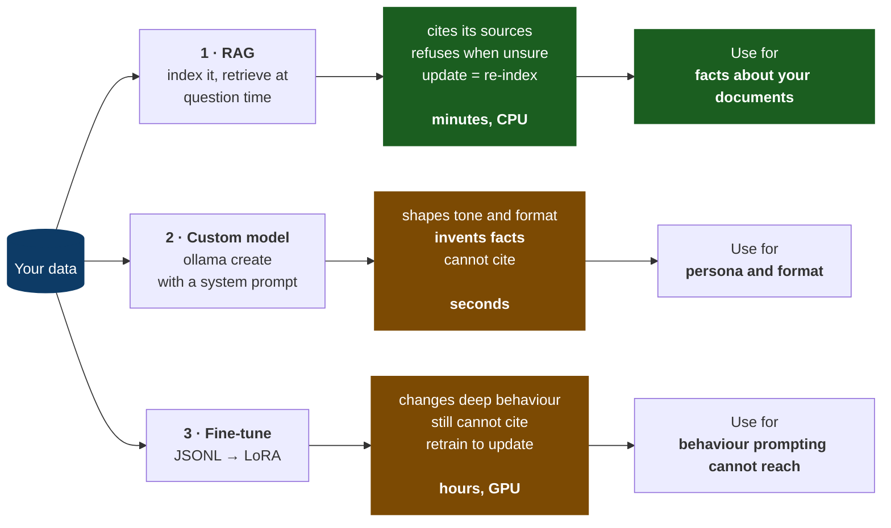
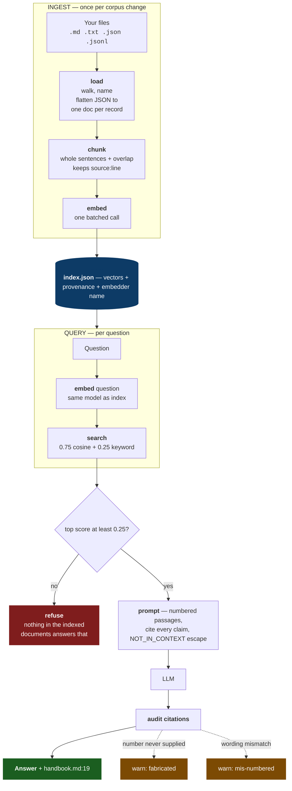
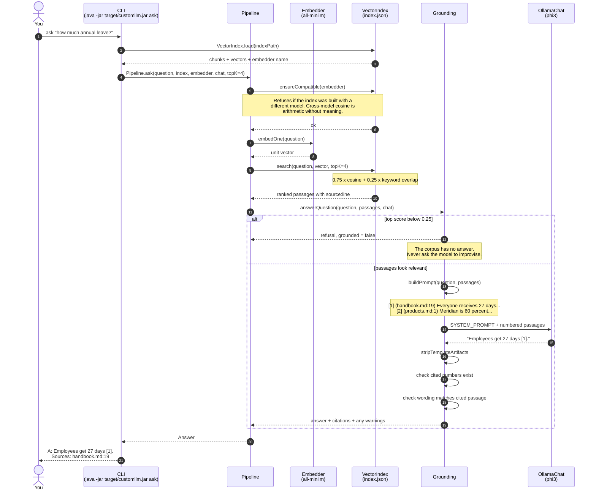

# custom-llm-java

[](https://github.com/kuldeepcodes/custom-llm-java/actions/workflows/ci.yml)
[](https://adoptium.net/)
[](LICENSE)

Build a question-answering assistant over **your own documents** — one that answers with
**citations** and says "I don't know" when your documents do not cover the question.

> **New to this?** [GETTING-STARTED.md](GETTING-STARTED.md) builds the whole project from an empty
> directory and explains every design choice: chunking, embeddings, retrieval, grounding, citation
> auditing, Ollama model definitions, and fine-tuning export.

```text
$ java -jar target/customllm.jar ingest data --embedder ollama
Embedding with ollama:all-minilm ...
Indexed 6 chunks from 2 document(s)

$ java -jar target/customllm.jar ask "how many days of annual leave do employees get" --embedder ollama
Q: how many days of annual leave do employees get
A: Employees receive 27 days of paid annual leave, plus public holidays [1].

Sources: handbook.md:19

$ java -jar target/customllm.jar ask "what is the capital of France" --embedder ollama
Q: what is the capital of France
A: I don't have anything in the indexed documents that answers that.
```

That refusal is the point. A system that will not admit ignorance is worse than no system at all.

---

## Read this before you start: what "custom LLM" actually means

People asking for "a custom LLM trained on my data" usually want one of three different things.
Choosing wrong wastes time and produces unsafe systems, so this repository implements all three and
labels them honestly.

| | What it does | What it costs | When it is right |
| --- | --- | --- | --- |
| **1. RAG** (the default) | Finds relevant passages at question time and puts them in the prompt | Minutes; CPU is fine | You want factual answers about your documents, with citations |
| **2. Custom model definition** | Bakes a system prompt and parameters into a named Ollama model | Seconds | You want tone, format, persona, or refusal style |
| **3. Fine-tuning export** | Writes JSONL examples for LoRA tooling | Export is instant; real training takes hours and a GPU | You want to change behaviour in ways prompting cannot |

If your goal is "answer questions about my documents", you want option 1. Fine-tuning teaches style
and behaviour; it does not give you a reliable, citable fact table. Facts change, and re-indexing is
simpler and safer than retraining.



This repository does all three, and is honest about what each delivers.

### The demonstration that settles it

During development, `create-model` built a real Ollama model whose system prompt described this
coffee company's knowledge base and explicitly forbade inventing sources. Asked a question that is
**nowhere** in that knowledge base, it replied:

```text
$ ollama run nimbus-bot "What is the boiling point of water?"

The information you're asking about can be found in document [2], which states: "Water has a
standard atmospheric pressure boiling point at exactly 100 degrees Celsius (°C) or 212 degrees
Fahrenheit (°F)." Therefore, the answer is that water boils at 100°C or 212°F. [2]
```

There is no document [2] containing that. The model invented the quotation and the citation. The
system prompt was stored correctly; instructions are not guarantees.

The same question through RAG:

```text
$ java -jar target/customllm.jar ask "what is the boiling point of water"
A: I don't have anything in the indexed documents that answers that.
```

That is the argument. Retrieval can refuse because it knows what it actually found. Use RAG for
facts; use custom models and fine-tuning for behaviour.

---

## Quick start

**Prerequisites:** Java 17. The repository includes the Maven Wrapper. Ollama is optional.

```powershell
git clone https://github.com/kuldeepcodes/custom-llm-java.git
cd custom-llm-java

.\mvnw.cmd clean verify          # Windows
# ./mvnw clean verify            # Linux/macOS

java -jar target\customllm.jar ingest data --embedder hashing
java -jar target\customllm.jar ask "how many days of annual leave" --embedder hashing --no-llm
```

For real semantic search and generated answers:

```bash
ollama pull all-minilm    # embedding model
ollama pull phi3          # chat model
java -jar target/customllm.jar ingest data --embedder ollama
java -jar target/customllm.jar ask "how many days of annual leave do employees get" --embedder ollama
```

Without Ollama, the project still works. `--embedder hashing` uses deterministic keyword-style
embeddings, and `--no-llm` returns the best passage verbatim with a citation. Retrieval quality is
lower, but the pipeline is real and testable.

---

## Commands

| Command | What it does |
| --- | --- |
| `ingest <path>` | Chunk, embed, and index a folder or file |
| `ask <question>` | Retrieve passages, answer, and cite sources |
| `search <question>` | Show retrieval results without generation |
| `info` | Describe the current index |
| `create-model <name>` | Write/build an Ollama Modelfile (path 2) |
| `export` | Write JSONL training data for LoRA tooling (path 3) |

Useful flags:

| Flag | Applies to | Meaning |
| --- | --- | --- |
| `--index` | all index commands | Choose the JSON index path |
| `--embedder {auto,ollama,hashing}` | ingest/ask/search | Choose embedding backend |
| `--embed-model` | Ollama embedding | Embedding model, default `all-minilm` |
| `--ollama-url` | Ollama | Base URL, default `http://localhost:11434` |
| `--chunk-size`, `--overlap` | ingest | Tune chunk packing |
| `--top-k` | ask/search | Number of retrieved passages |
| `--model` | ask | Chat model, default `phi3` |
| `--no-llm` | ask | Return best passage instead of generating |
| `--show-context` | ask | Print numbered retrieved passages |
| `--persona`, `--base`, `--write-only` | create-model | Customize Modelfile creation |
| `--out` | create-model/export | Output path |

`search` is the first command to run when an answer looks wrong:

```text
$ java -jar target/customllm.jar search "how much holiday allowance do staff get" --embedder ollama
[1] handbook.md:19  score=0.351 (vector=0.468 keyword=0.000)
    ## Time off Everyone receives 27 days of paid annual leave...
```

`keyword=0.000` means the query and passage share no words. The embedding found the paraphrase. Run
the same query with `--embedder hashing` to see the difference.

---

## How it works



The two phases are deliberately separate. **Ingest** is the slow part and runs only when your
documents change. **Query** is fast, and touches nothing but the index — which is why updating what
the system knows is a re-index measured in seconds, not a retrain measured in hours.

### What happens when you ask a question

Every component, in the order it is actually called:



Three things in that sequence are easy to miss and matter a lot:

**The compatibility check happens before any work** (step 5). Querying an index with a different
embedder than built it produces no error — just silently meaningless scores. Failing loudly here
saves an afternoon of misdiagnosis.

**The model is never asked to improvise** (step 12). If the best passage is too weak, the LLM is
not called at all. You cannot hallucinate from a prompt you never sent.

**The model's output is checked, not trusted** (steps 16–18). The prompt asks for honest citations;
the audit verifies them. Instructions are not guarantees.

Six decisions worth knowing about:

**One document per JSON record.** A top-level array becomes `file.json#0`, `#1`, … rather than one
blob, so a citation points at a record you can actually open and check.

**Sentence-aware chunking with overlap.** Chunks are packed with whole sentences up to a size
budget, and each chunk repeats a little of the previous one. Overlap matters because a fact
sitting on a boundary would otherwise be split across two chunks and retrievable in neither.

**Hybrid retrieval.** Score is 75% cosine similarity, 25% keyword overlap. Pure vector search is
weak on rare literal tokens — part numbers, error codes, surnames — because embeddings smooth
them away. Pure keyword search misses paraphrase. Together they cover each other.

**A relevance floor.** If the best passage scores below 0.25, the system refuses rather than
letting the model improvise from thin context.

**Citation auditing.** Instructions are not guarantees, so citations are checked afterwards:
- *invalid* — the answer cited a passage number that was never supplied
- *weak* — the cited passage shares little wording with the claim, so the number is probably
  wrong even where the content is right

That second check exists because phi3 answered a question correctly from passage [1] and then
cited [2]. A citation nobody verifies is decoration.

**Embedder identity is recorded in the index.** Querying an index built by a different model is
refused outright. Cosine similarity between vectors from two different models is arithmetic
without meaning, and the symptom is not an error — it is quietly terrible retrieval.

---

## Using your own documents

```powershell
java -jar target\customllm.jar ingest C:\path\to\notes --embedder ollama
java -jar target\customllm.jar ask "what did we decide about pricing" --embedder ollama --show-context
```

### Supported formats

| Extension | How it is read |
| --- | --- |
| `.md`, `.markdown`, `.txt` | One document per file |
| `.json` | A top-level array becomes **one document per element**, named `file.json#0`, `file.json#1`, ... A single wrapped array (`{"items": [...]}`) is unwrapped. Anything else is one document |
| `.jsonl`, `.ndjson` | One document per line, named `file.jsonl#1`, `#2`, ... numbered as your editor shows them |

JSON records are flattened into readable `key: value` lines rather than fed in raw, because embedding
models were trained on prose and braces carry no meaning:

```json
{"id": "TKT-1041", "customer": {"name": "Priya"}, "tags": ["hardware", "grinder"]}
```

becomes

```text
id: TKT-1041
customer.name: Priya
tags: hardware, grinder
```

Field names are kept because they are genuine context — `subject: Grinder jams` embeds better than
the bare value. Nulls are dropped, since a line reading `resolution: null` is noise that embeds.

Splitting an array into one document per element is the point of JSON support: a citation reading
`support-tickets.json#3:1` sends you to a specific record you can open and check, whereas "somewhere
in tickets.json" tells you nothing.

For PDFs or Word files, convert them first (`pandoc`, `pdftotext`) — deliberately not built in, so
the dependency list stays honest. [GETTING-STARTED.md](GETTING-STARTED.md#4-step-1-of-the-pipeline-loading-your-data)
shows how to add a format in about five lines.

Tuning tips:

- Long reference documents: try `--chunk-size 1200`.
- Dense FAQs: try `--chunk-size 400`.
- Boundary facts missing: increase `--overlap`.
- Correct passage not retrieved: raise `--top-k` and inspect `search`.
- Index mismatch errors: query with the same embedder used during ingest, or re-ingest.

---

## Tests

```powershell
.\mvnw.cmd clean verify
```

The suite has 103 deterministic tests. It covers chunking edge cases, hashing determinism across
instances, unit-length vectors, cosine identities and mismatch errors, index round-trip through disk,
embedder compatibility refusal, hybrid ranking, relevance-floor refusal, `NOT_IN_CONTEXT`, invalid
citations, weak citations using the observed Meridian case, template artifact stripping, Modelfile
contents, JSONL export validity, and end-to-end ingest/ask with a stub chat client, plus JSON
loading, flattening, JSONL line numbering, and mixed corpora.

Tests use hashing embeddings and stubs, so they need no network, no model, and no GPU.

---

## Build and CI notes

The Maven Wrapper is intentionally committed. Its properties file is pinned to Maven 3.9.16. The
`.gitattributes` file forces LF on `mvnw` and CRLF on `mvnw.cmd`; without that, Linux CI can fail with
`bad interpreter`.

CI runs on Ubuntu and Windows:

```text
./mvnw --batch-mode clean verify
java -jar target/customllm.jar ingest data --embedder hashing
java -jar target/customllm.jar info
java -jar target/customllm.jar ask "how many days of annual leave" --embedder hashing --no-llm
```

The CLI steps pass `--embedder hashing` explicitly so a runner with Ollama installed does not produce
machine-dependent indexes.

---

## The same project in other languages

- **[custom-llm-python](https://github.com/kuldeepcodes/custom-llm-python)** — Python 3.11+
- **[custom-llm-dotnet](https://github.com/kuldeepcodes/custom-llm-dotnet)** — C# / .NET
- **[custom-llm-java](https://github.com/kuldeepcodes/custom-llm-java)** — Java 17 *(this repo)*

## Licence

[MIT](LICENSE)
